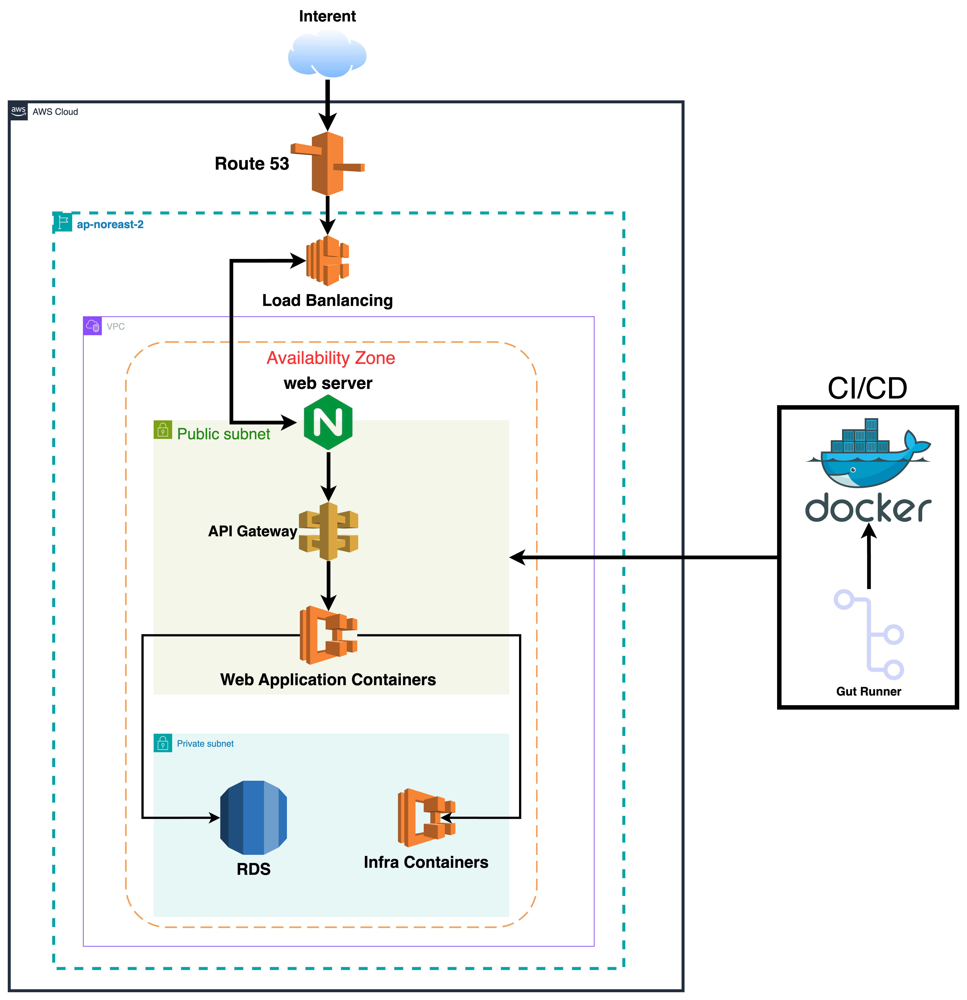

# What's Next?

## 개요
주식 시장의 방대한 뉴스와 데이터를 쉽게 분석하고, **주가 상승 요인** 및 **미래 상승 가능성**을 예측할 수 있는 서비스를 제공합니다. 사용자에게 **주요 뉴스의 테마 기반 검색**, **주가 상승 원인 분석**, **미래 상승 가능성이 있는 종목에 대한 인사이트**, **주가 정규화 및 종목 간 연관성 분석** 기능을 지원합니다.

## 서버 아키텍처
서비스는 AWS 기반으로 설계되었으며, 확장성과 보안성을 고려한 구조입니다.


## 기능 설명
### 핵심 기능
- **주가 상승 원인 분석**: 주가가 상승한 이유를 테마별로 분석하여 제공합니다.
- **상승 가능성 인사이트 제공**: 과거 데이터를 바탕으로 향후 상승 가능성이 높은 종목을 예측합니다.
- **테마 기반 뉴스 검색**: 사용자가 선택한 테마나 주제에 따른 뉴스를 쉽게 검색할 수 있습니다.
- **주가 정규화 및 관련 종목 분석**: 주가를 정규화하여 연관성이 높은 종목들을 시각적으로 분석할 수 있습니다.


### 주요 구성 요소
- **Web Server**: 정적 파일 캐싱 및 리버스 프록시 기능을 수행합니다.
- **API Gateway**: 외부 클라이언트 요청을 애플리케이션 서버로 안전하게 전달합니다.xq
- **애플리케이션 서버 (프라이빗 서브넷)**:
  - **Auth Server**: 인증 서비스 처리
  - **Search Server**: 검색 요청 처리
  - **타임딜 및 결제 서버**: 시간제한 할인 및 결제 기능
- **데이터베이스 및 캐시**:
  - **Redis**: 세션 및 캐시 데이터 저장
  - **MongoDB**: 비정형 데이터 저장
  - **Kafka**: 실시간 메시지 스트리밍 및 로그 처리
  - **PostgreSQL**: 관계형 데이터 저장
  - **MinIO**: 객체 스토리지

### 네트워크 구성
- **퍼블릭 서브넷**: API Gateway 및 Load Balancer를 배치하여 외부 접근을 관리합니다.
- **프라이빗 서브넷**: 애플리케이션 서버와 데이터베이스는 외부에서 직접 접근할 수 없도록 구성했습니다.

## 개발 및 배포
- **CI/CD**: GitHub Actions을 통해 자동 빌드 및 배포가 진행됩니다.
- **Docker**: Docker Hub를 활용하여 이미지를 자동으로 배포합니다.

## 브랜치 전략
- **Main**: 배포용 브랜치로, 안정적인 코드가 포함됩니다.
- **Feature**: 각 기능별 브랜치로, `Main` 브랜치로 병합되기 전 기능 개발 및 테스트가 이루어집니다.

## 코드 컨벤션
- Google Code Style을 준수하며, STS Check Style 플러그인을 적용하여 코드의 일관성을 유지하고 있습니다. [Google Java Style Guide](https://google.github.io/styleguide/javaguide.html)

## 성능 최적화
- **Redis 캐시**: 캐싱 서버를 활용하여 응답 시간을 줄입니다.
- **쿼리 최적화**: DB 통신을 최소화하고 인덱스 최적화 및 쿼리 튜닝을 통해 성능을 개선합니다.
- **비동기 처리**: 외부 API 호출을 비동기로 처리하여 효율성을 높입니다.

## 테스트
- **단위 테스트**: Mockito Framework를 사용하여 고립된 테스트 작성
- **성능 테스트**: NGrinder를 통한 성능 테스트 수행

## 기술 스택
- **Backend**: Spring Boot, Maven, Mybatis, Redis, Docker, MariaDB, Java 8
- **CI/CD**: Jenkins, GitHub Actions, Docker Hub
- **Cloud**: AWS Cloud Platform (일부 Naver Cloud 이전 예정)

## Wiki
기술적 이슈와 해결 방법에 대한 자세한 내용은 [Wiki](https://github.com/Hot-stock/backend/wiki)에서 확인할 수 있습니다.

---

## 사용 방법
1. 이 프로젝트를 클론합니다.
   ```bash
   git clone https://github.com/Hot-stock/backend.git
Docker Compose를 통해 로컬 환경을 구성합니다.

로컬에서 서버를 시작하고 localhost:8080으로 접속하여 API에 접근할 수 있습니다.


## 기여 방법

프로젝트에 기여하고 싶다면, 아래 절차를 따라 주세요:

1. **레포지토리를 포크합니다**.
  - GitHub에서 본 레포지토리를 자신의 계정으로 포크하세요.

2. **새로운 기능 브랜치를 생성합니다**.
   ```bash
   git checkout -b feature/AmazingFeature
   ```

3. **기능을 추가하고 커밋합니다**.
   ```bash
   git commit -m 'Add some AmazingFeature'
   ```

4. **브랜치를 푸시합니다**.
   ```bash
   git push origin feature/AmazingFeature
   ```

5. **Pull Request를 생성하여 제출합니다**.
  - 변경 사항을 설명하고, 코드 리뷰를 위해 Pull Request를 작성해 주세요.
