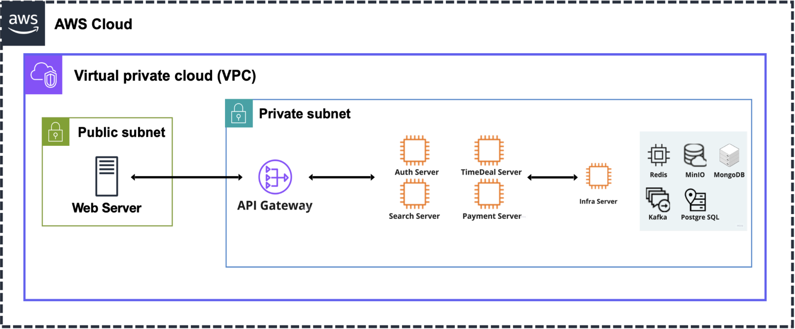

# What's Next?
### 사람들의 관심이 급증하는 주식을 찾아 사용자에게 검색 서비스 및 알림을 제공하는 서비스입니다. 
### 비즈니스 규칙과 기술적인 문제에 대한 해결 방법은 [WIKI](https://github.com/Hot-stock/backend/wiki)에서 확인할 수 있습니다. 
---
## 서버 구조
아래 다이어그램은 현재 애플리케이션의 AWS 기반 서버 아키텍처를 보여줍니다. 이 구조는 확장성, 보안성, 그리고 안정성을 고려하여 설계되었습니다.

### 주요 구성 요소
1. **Load Balancer**: 트래픽을 여러 서버로 분산하여 애플리케이션의 가용성과 성능을 보장합니다.
2. **API Gateway**: 외부 클라이언트 요청을 받아 프라이빗 서브넷 내의 애플리케이션 서버로 전달하는 역할을 합니다. 보안 강화와 트래픽 제어를 위해 사용됩니다.
3. **애플리케이션 서버** (프라이빗 서브넷):
    - **Auth Server**: 인증 관련 서비스를 처리합니다.
    - **Search Server**: 검색 요청을 처리하는 서버입니다.
    - **TimeDeal Server** 및 **Payment Server**: 각각 시간제한 할인(타임딜)과 결제 처리를 담당합니다.
4. **데이터 스토리지 및 캐시 시스템**:
    - **Redis**: 캐시 및 세션 데이터를 저장해 응답 속도를 최적화합니다.
    - **MongoDB**: 비정형 데이터를 저장하는 NoSQL 데이터베이스입니다.
    - **Kafka**: 대용량 메시지 스트리밍 및 실시간 로그 처리에 사용됩니다.
    - **PostgreSQL**: 관계형 데이터베이스로 핵심 데이터를 저장합니다.
    - **MinIO**: 파일 저장용 객체 스토리지입니다.

### 네트워크 구성
- **퍼블릭 서브넷**: Load Balancer와 API Gateway가 위치하며, 외부에서 접근 가능합니다.
- **프라이빗 서브넷**: 애플리케이션 서버와 데이터베이스, 메시징 시스템은 외부에서 직접 접근할 수 없으며, 보안을 위해 퍼블릭 서브넷을 통해서만 접근이 가능합니다.

## 프로젝트의 전체적인 구조
- **CI/CD**: GitHub webhook을 통해 Jenkins에서 CI/CD를 진행합니다.
- **서버 배포**: 모든 서버는 AWS Cloud Platform에서 구동 중이며, 각 서버는 퍼블릭 또는 프라이빗 서브넷에 위치합니다.
    - 구동 중인 주요 서버: Main Delfood Server, Redis Server, MariaDB Server
    - **Public IP**는 Main Server에만 할당되어 있습니다.
---
## 프로젝트의 주요 관심사
### 공통사항
- 지속적인 성능 개선
- 나쁜 냄새가 나는 코드에 대한 리팩토링

### 코드 컨벤션
- Google Code Style을 준수
- STS Check Style 플러그인을 적용하여 코드 컨벤션을 유지
- [Google Java Style Guide](https://google.github.io/styleguide/javaguide.html)

### 성능 최적화
- 캐싱 서버(예: Redis)를 적극 활용하여 서버 부하 감소
- DB 서버와의 통신을 최소화 (예: N+1 쿼리를 지양)
- 인덱스 최적화 및 쿼리 튜닝
- 비동기 처리를 통해 외부 API 호출의 효율성 증가
---
## 브랜치 관리 전략
GitHub Flow를 사용하여 브랜치를 관리합니다. 
모든 브랜치는 Pull Request를 통해 코드 리뷰 후 merge됩니다. 
메인 브랜치인 `develop`에는 많은 내용이 merge되지 않았습니다. 현재 진행 중인 개발 사항은 PR을 확인하세요.

- **Main**: 배포에 사용됩니다.
- **Feature**: 각 기능 개발을 진행할 때 사용하는 브랜치입니다.
---
## 테스트
- Mockito Framework를 활용하여 고립된 테스트 코드 작성
- Jenkins CI를 사용하여 테스트 자동화
- 협업하는 동료의 소스코드에 테스트 코드를 작성하여 코드 이해도를 높이고 있습니다.
---
## 성능 테스트
- NGrinder를 설치하여 성능 테스트 진행
---
## 사용 기술 및 환경
- **Backend**: Spring Boot, Maven, Mybatis, Redis, Docker, MariaDB, Java 8
- **CI/CD**: Jenkins, GitHub Actions, Docker Hub
- **Cloud**: AWS Cloud Platform (Naver Cloud로 일부 이전 중)
---
## Wiki
프로젝트에 대한 자세한 기술 이슈와 해결 방법은 [Wiki](https://github.com/Hot-stock/backend/wiki)에서 확인하실 수 있습니다. 
---
## CI
- **Jenkins**: PR 시 자동으로 Build 및 Test 진행
- **Naver Cloud Platform**: 현재 CI 서버로 사용
- PR 마다 자동 빌드 및 테스트가 진행됩니다.
---
## CD
- **Docker**: CI 서버에서 빌드된 이미지를 Docker Hub에 push 후 Delfood 메인 서버에 배포합니다.
- Docker Hub에서 자동으로 이미지를 받아 실행하는 방식으로 배포가 진행됩니다.
---
